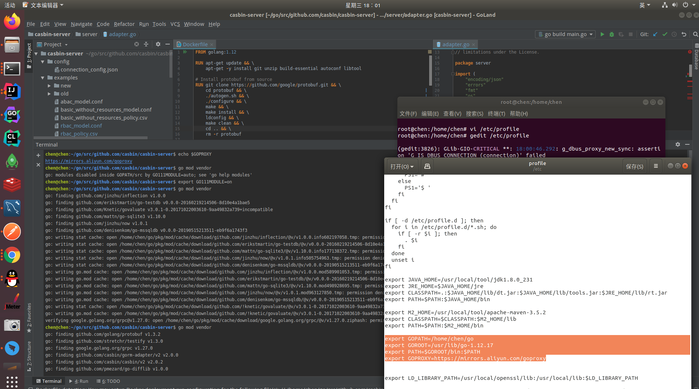
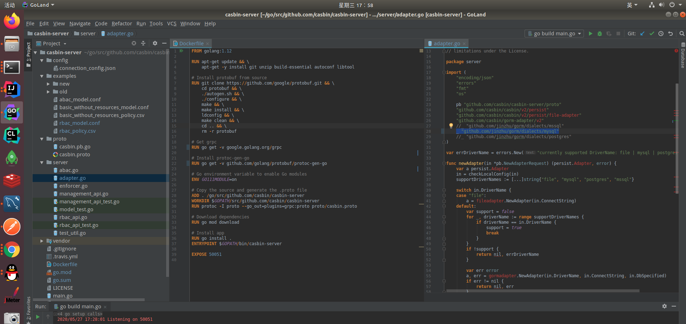
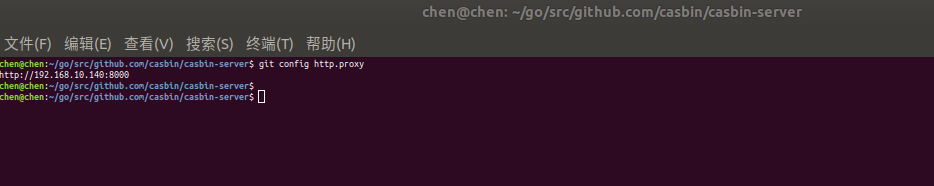
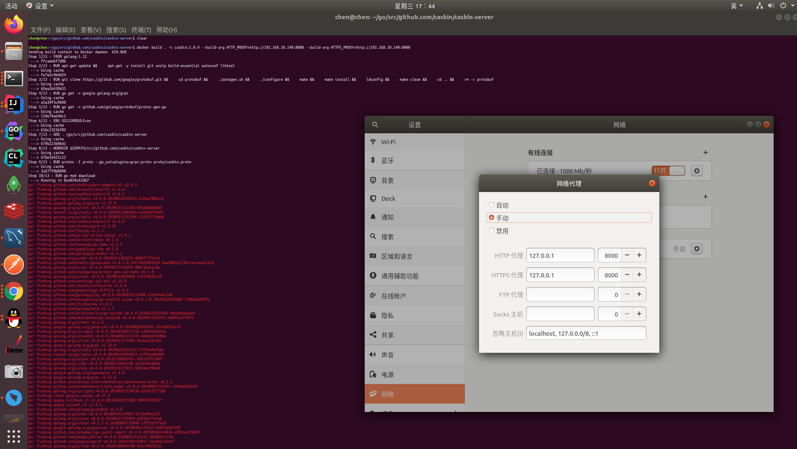
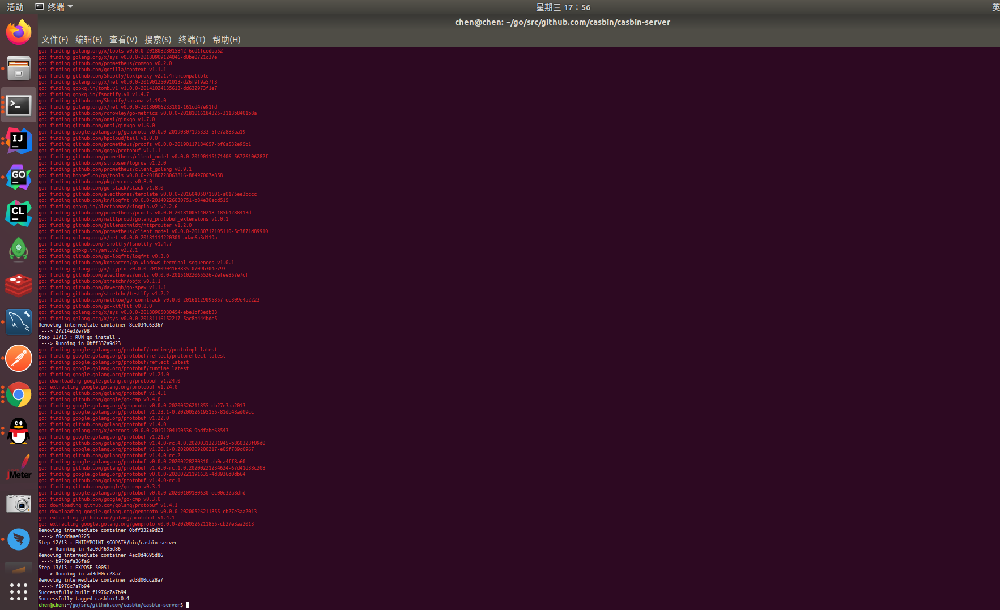
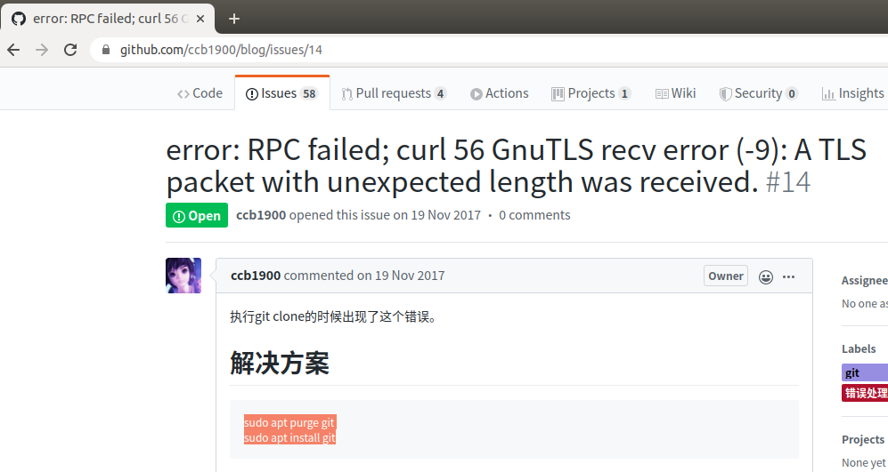

##1.获取原码
原码地址 -> https://github.com/casbin/casbin-server
##【Terminal】
        go get github.com/casbin/casbin-server

##2.设置go代理
####【Terminal】
    gedit /etc/profile
    source /etc/profile 
    
####添加代理内容
    export GOPROXY=https://mirrors.aliyun.com/goproxy

####【Terminal】查看go代理信息  
    echo $GOPROXY

####【Terminal】配置go项目cabin-server
    export GO111MODULE=on
    go mod vendor
  
                  

##3.docker镜像打包
####开启casbin-server数据库mysql支持(去除mysql注释即可)
    _ "github.com/jinzhu/gorm/dialects/mysql"
    

####配置cmd非root账号可执行docker命令
####【Terminal】添加group;加入group；重启(不生效时,重启电脑即可)
    sudo groupadd docker
    sudo gpasswd -a chen docker
    sudo /etc/init.d/docker restart

####【Terminal】设置git代理(使用127.0.0.1不成功)
    git config --global http.proxy http://192.168.10.140:8000
    git config --global https.proxy http://192.168.10.140:8000
   

####【Terminal】本地开启代理;docker打包设置代理(不是用127.0.0.1)
    docker build . -t casbin:1.0.4 --build-arg HTTP_PROXY=http://192.168.10.140:8000 --build-arg HTTPS_PROXY=http://192.168.10.140:8000
  
  
    
##-1.可能的问题
####【Terminal】docker build 依赖加载问题    
    sudo apt purge git	
    sudo apt install git
   
   